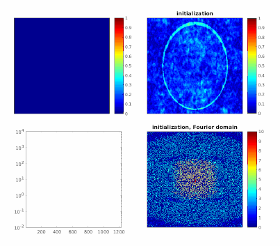

## GIRAF: Generic Iterative Reweighted Annihilating Filter

MATLAB implementation of the GIRAF algorithm for convolutional structured low-rank matrix recovery. 
GIRAF can be used for a variety of structured low-rank matrix recovery problems arising in compressive imaging.
One of its main applications is in compressed sensing MRI reconstruction.
GIRAF is used to implement _continuous domain compressesd sensing_ regularization penalties
that penalize the rank of a convolutional structured matrix built form k-space (Fourer) data.

In particular, GIRAF is an iterative re-weighted least squares algorithm
that can be iterpreted alternating between two subproblems:
     (1) updating an annihilating filter for the data, and 
     (2) solving for the data x that is optimally nulled 
         by the annhilating filter in a least-squares sense
See the animation below, which shows the iterates of the GIRAF algorithm applied to the recovery of a
piecewise constant image from missing Fourier data. The annihiling filter (shown in image domain) encodes
the edges of the image:

## Optimzation problem
GIRAF is designed to solve following the optimization problem:

_||Ax-b||2+&lambda;||T(x)||pSp_%nbsp;%nbsp;%nbsp;%nbsp;(OPT)

where _x_ is a mutli-dimensional array of data (typically in Fourier domain), 
_A_ is a linear measurement operator, _b_ is the measured data, 
_T_ is a matrix lifting operator that maps the data _x_ to a Toeplitz-like
matrix, _||.||Sp_ is the Schatten-p quasi-norm, and _&lambda;_
is a regularization parameter.

## References
GIRAF was introduced in the conference paper:
> [1] Ongie, G., and Mathews, J. "A fast algorithm for structured low-rank matrix recovery with applications to undersampled MRI reconstruction." Biomedical Imaging (ISBI), 2016 IEEE 13th International Symposium on. IEEE, 2016.

A full-length journal version of this work is also available as a pre-print:
> [2] Ongie, G., and Mathews, J. "A fast algorithm for convolutional structured low-rank matrix recovery." Online at: https://arxiv.org/abs/1609.07429 

## Code Example
A standalone implementation of the algorithm is available in `giraf.m`
Demo illustrating GIRAF for undersampled MRI reconstruction are provided in
`giraf_demo1.m` - recovery of noiseless undersampled data
`giraf_demo2.m` - recovery of noisy & undersampled data
`giraf_demo3.m` - effect of filter size on recon quality

## Reproducible Research
Code to reproduce the experiments reported in the paper [2] is provided in the subfolder `reproduce`
This includes implementations of other commonly used algorithms for solving (OPT), including
singular value thresholding, alternating projections, and the direct IRLS approach.

Note: To perform direct comparisons with the LORAKS algorithm requires that you you have the public LORAKS code installed.
LORAKS is available for download at: http://mr.usc.edu/download/loraks/

